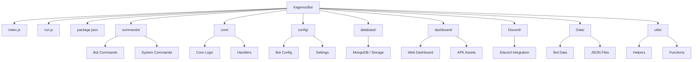

<div align="center">
  <h2>Official Version KagenouBot ⚔️</h2>
</div>
<p align="center">
  
</p>

Welcome to **Official version of KagenouBot ver 12.0.0**, an elite Facebook Messenger bot inspired by *The Eminence in Shadow*. This multi-system bot is built with flexibility, speed, and customization in mind. KagenouBot is your ultimate companion in automating and enhancing chat experiences.


# Introduce the contributors of our KagenouBot 

 - **Liane Cagara** — she was the one who really advice me to create and adjust functions and to solve problems on code.

- **Francis Loyd Raval** — He is the one who helping to setup other systems and functions.

- **Kenneth Panio** — He is the one who really advice to modify systems and add functions.

- **Jimmuel Rivera** - Suggesting commands and contributes to our botfile.

- **Jonell Magallanes** - Biggest thanks for suggesting DiscordBot and Help to setup.

***Join Our Community*** [Join here](https://facebook.com/groups/1989560245158541/)

> [!NOTE]
> To protect your credentials account and mongodb uri and dashboard password. you can put it on .env.


---

## Note: All commands/codes are created by me (Aljur pogoy), except for a few sourced from Botpack."

---

# KagenouBot Dashboard APK.
- Check the releases GitHub.

---


## Introduction: The Seven Shadows

The Seven Shadows are Cid Kagenou's elite shadow organization. Each member possesses unique skills and plays a crucial role in his grand schemes.

### King of Shadow Garden

| Name              | Image                      | Description |
|-------------------|----------------------------|-------------|
| Cid Kagenou (Shadow) |  | Shadow is the king of the Seven Shadows and leader of Shadow Garden. A brilliant tactician and a true mastermind hidden behind a humble facade. |

### Members of the Seven Shadows

| Member Name | Image                   | Description |
|-------------|-------------------------|-------------|
| Alpha       |  | Alpha is the strongest and most loyal member, a powerful magic swordsman who leads the Seven Shadows. |
| Beta        |   | The strategist and tactician of the group, calm and calculating. |
| Gamma       |  | A martial arts expert and voice of reason, swift and deadly in close combat. |
| Delta       |  | An expert archer known for her loyalty and deadly precision. |
| Epsilon     |  | Master of illusion and deception, clever and manipulative. |
| Zeta        |   | A stealthy assassin skilled in infiltration and hand-to-hand combat. |
| Eta         |    | A compassionate healer and expert in life magic. |

---


# Note 📜
- Some command are pterodactyl 

### Basic Command Format, execute async()

```js
module.exports = {
  name: 'test',
  category: 'Test',
  execute: async (api, event, args, commands, prefix, admins, appState, sendMessage) => {
    sendMessage(api, { threadID: event.threadID, message: 'This is a test command!' });
  },
};
```
## Basic Command format, async run({})

```js
module.exports = {
  config: {
    name: "ping",
    author: "Aljur pogoy",
    description: "Responds with Pong!",
    role: 0,
    usage: "<prefix>ping",
    aliases: ["p"],
  },
  async run({ api, event }) {
    const { threadID, messageID } = event;
    await api.sendMessage("Pong!", threadID);
  },
};
```


# KagenouBot Ver 4.0.0 is now have own styler, inspired by cassidy-styler.

### Usage;
```js
const styler = AuroraBetaStyler.format{
  styleOutput: ({
    headerText,
    headerSymbol = "🏰",
    headerStyle = "bold",
    bodyText,
    bodyStyle = "bold",
    footerText = "",
  });

console.log(styler)

━━━『 📜 Law // with a bold font 』━━━
A law // with a fancy font
━━━━━━━━━━━━━━━━━━━
Developed by: Aljur pogoy // with a bold font because it supports **BOLD**.

can do ${LINE}
const AuroraBetaStyler = require("@aurora/styler")
const LINE = AuroraBetaStyler;

var test = "A new!"
console.log(LINE)
console.log(test)

// Result
// ━━━━━━━━━━━━━━
// A new!
//

```


---

## Configuration Guided 

### config.json
```json
{
  "admins": ["100073129302064", "100080383844941", "61560407754490"]
}
```

### appstate.json
> Put your appstate credentials here. **(Not recommended to use your main account)**

```json
{}
```

---

## What's New in KagenouBot

### Dashboard web 
- It now supports dashboard website where you can manage the bot using web dashboard.

### MongoDB Integration
- KagenouBot now includes MongoDB support for storing user data, command configurations, and bot settings.
- Easily scale your bot's storage capacity and improve data persistence with MongoDB's robust database solutions.

### Enhanced Reply Handling
- Improved message reply detection, allowing for more precise and context-aware responses.
- Optimized command processing for faster and more reliable message handling.

### Modular Command Structure
- Simplified command management with clearly organized command files and directories.
- ~~Support for multiple systems and command categories, including Jinwoo-System, Alpha-System, and GoatBot-System.~~

### Improved Bot Performance
- Faster command execution and reduced latency.
- Optimized resource management for smoother operation.

### Customizable Prefix and Permissions
- Flexible command prefixes and role-based permissions for fine-tuned bot control.
- Easy-to-edit configuration files for quick customization.


## You can Deploy  on Render, and Bot-Hosting.net, and railway. 
*Note*: You can also deploy on pterodactyl Hosting.

### Stpes on How to deploy on render

**Step 1:** Fork my repository

**Step 2:** Login Dashboard on Render

**Step 3:** Connect your GitHub or Google gmail

**Stel 4:** Choose the repository, choose KagenouBot and deploy.

> Login required via [Render](https://render.com)
---


## 🚧 **Requirement**
- Node.js 22.x [Download](https://nodejs.org/dist/v22.0.0) | [Home](https://nodejs.org/en/download/) | [Other versions](https://nodejs.org/en/download/releases/)
- Knowledge of **programming**, JavaScript, NodeJs


## License

```
MIT License

Copyright (c) January 20, 2025 
Aljur Pogoy / GeoArchonsTeam / Cassidy-Team

Permission is hereby granted, free of charge, to any person obtaining a copy
of this software to use, copy, modify, distribute, and publish as needed.
```


## NMAP PROJECT


> [!NOTE]
> This project is still being updated and is expected to be completed by February 2027.
>


## Credits

- **Shadow Garden Lore** - Inspired by *The Eminence in Shadow*
- **Bot Devs** - Aljur Pogoy and his Girlfriend 

<p align="center">
  
</p>
